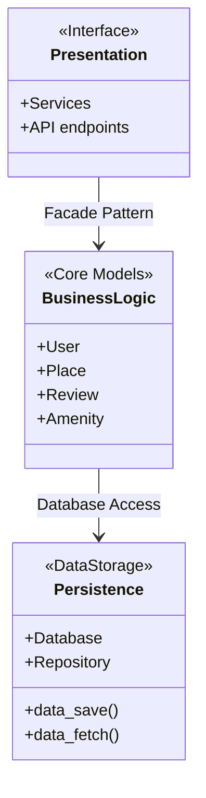
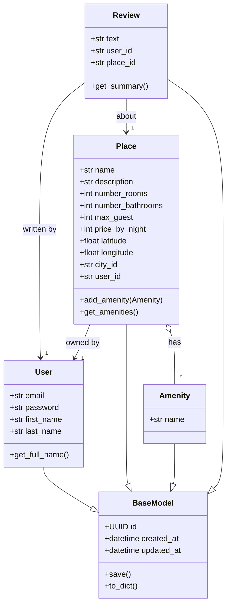

# C#26 :school:  - HBnB Team Project - 

## 📌 Objective

The goal of this task is to create a **high-level package diagram** that illustrates the **three-layer architecture** of the HBnB Evolution application. The diagram provides a conceptual overview of how the main components of the system are organized and how they communicate with each other using the **Facade Pattern**.

## 🧱 Layered Architecture Overview

The HBnB Evolution system follows a classic **3-layer architecture**:

### High-Level Package Diagram


### 1. Presentation Layer (API / Services)
- This layer handles the interaction between the user and the application. It includes all the services and APIs that are exposed to the users.

### 2. Business Logic Layer (Models)
- This layer contains the core business logic and the models that represent the entities in the system.
- Includes model managers for:
  - `User`
  - `Place`
  - `Review`
  - `Amenity`
- Exposes a **Facade** interface to decouple upper and lower layers.

### 3. Persistence Layer
- This layer is responsible for data storage and retrieval, interacting directly with the database..


---

## 🔁 Communication Flow

- **Presentation → Business Logic:**  
  The **Facade Pattern** is used to expose a simplified, unified interface from the Business Logic Layer to the Presentation Layer.

- **Business Logic → Persistence:**  
  Business logic components access data through well-defined **Repository** or **DAO** interfaces, abstracting the database layer.

---

## 📊 Diagram

The high-level package structure is represented below using **UML syntax (Mermaid.js)**:


🔍 Diagram Explanation

1. Presentation Layer (Presentation)
	•	This is what users interact with.
	
  •	It includes:

	  •	The website or frontend interface
	  •	API endpoints like /api/v1/users
	  •	It receives requests from users and sends back responses.

2. Business Logic Layer (BusinessLogic)

	•	This layer contains the core logic and decision-making.
	
    •	It works with the main models: User, Place, Review, Amenity.
	
    •	 It validates input, applies rules, and controls the data flow.

3. Persistence Layer (Persistence)

	  •	This is the data storage layer.
	
    •	It connects to the database and manages how data is saved and retrieved.
	
    •	Methods like data_save() and data_fetch() are used to interact with the database.

⸻

🔁 Layer Interactions
	
  ```•	Presentation → Business Logic:```
  
  Uses the Facade Pattern, meaning the interface communicates through a single, simplified entry point into the logic layer.```
	
 ``` •	Business Logic → Persistence:```

The logic layer accesses the database to save or retrieve data as needed.

### Detailed Class Diagram for Business Logic Layer


🔍 Diagram Explanation
  
  •	```BaseModel```: 
  
  Parent class shared by all others. Provides unique ID and timestamps (created_at, updated_at).
	
  •	```User```: A person using the app. Can own places and write reviews.
	
  •	```Place```: A listing created by a user. Includes location, price, number of rooms, etc.
	
  •	```Amenity```: A feature (e.g., Wi-Fi, pool, extra accessories) that can be added to a place.
	
  •	```Review```: Feedback written by a user about a specific place.

🔗 Relationships
	
  •	A ```Place``` is owned by one User.

  •	A ```Review``` is written by one User and is about one Place.
	
  •	A ```Place``` has many Amenities ```(Place o-- "*" Amenity)```, meaning a place can include several features.

⸻
