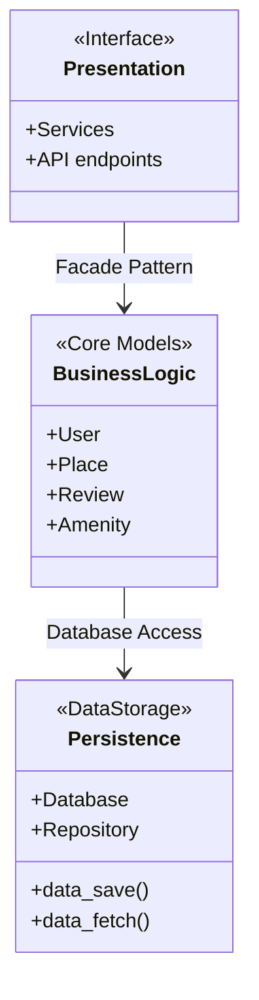
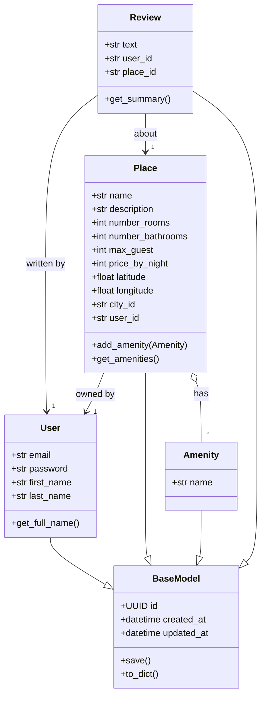
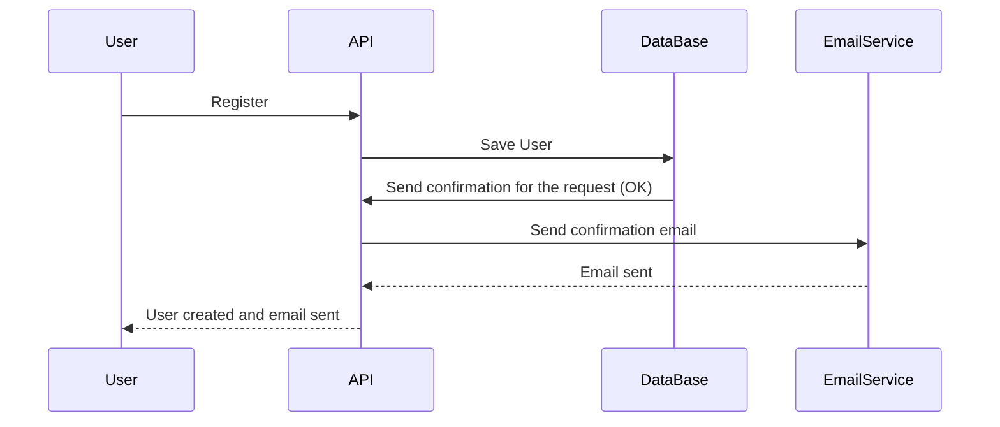
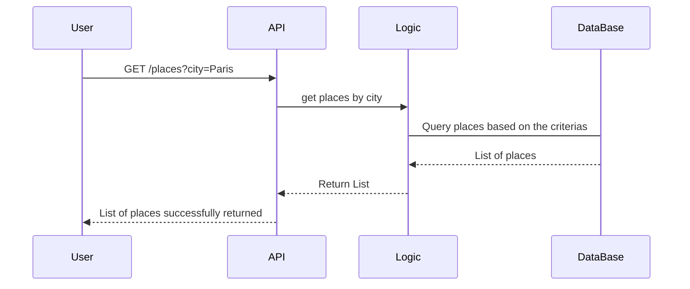

# C#26 :school:  - HBnB Team Project - 

## 📌 Objective

The goal of this task is to create a **high-level package diagram** that illustrates the **three-layer architecture** of the HBnB Evolution application. The diagram provides a conceptual overview of how the main components of the system are organized and how they communicate with each other using the **Facade Pattern**.

## 🧱 Layered Architecture Overview

The HBnB Evolution system follows a classic **3-layer architecture**:

### High-Level Package Diagram


### 1. Presentation Layer (API / Services)
- This layer handles the interaction between the user and the application. It includes all the services and APIs that are exposed to the users.

### 2. Business Logic Layer (Models)
- This layer contains the core business logic and the models that represent the entities in the system.
- Includes model managers for:
  - `User`
  - `Place`
  - `Review`
  - `Amenity`
- Exposes a **Facade** interface to decouple upper and lower layers.

### 3. Persistence Layer
- This layer is responsible for data storage and retrieval, interacting directly with the database..


## 🔁 Communication Flow

- **Presentation → Business Logic:**  
  The **Facade Pattern** is used to expose a simplified, unified interface from the Business Logic Layer to the Presentation Layer.

- **Business Logic → Persistence:**  
  Business logic components access data through well-defined **Repository** or **DAO** interfaces, abstracting the database layer.


---
### Detailed Class Diagram for Business Logic Layer


🔍 Diagram Explanation
  
  •	```BaseModel```: 
  
  Parent class shared by all others. Provides unique ID and timestamps (created_at, updated_at).
	
  •	```User```: A person using the app. Can own places and write reviews.
	
  •	```Place```: A listing created by a user. Includes location, price, number of rooms, etc.
	
  •	```Amenity```: A feature (e.g., Wi-Fi, pool, extra accessories) that can be added to a place.
	
  •	```Review```: Feedback written by a user about a specific place.

---


🧭 Class Relationships

	
  •	🧭 ```User → BaseModel```: Inherits from BaseModel (as do all other main classes).

  •	🧭 ```Place → User```: A place is owned by one user.
	
  •	🧭 ```Review → User```: A review is written by one user.
	
  •	🧭 ```Review → Place```: A review is about one specific place.
	
  •	🧭 ```Place o-- "*" Amenity```: A place can have many amenities (composition relationship).


## 🔁API Interaction Flow – Sequence Diagrams

### 👤User Registration




	
🔍 Explanation of Interactions

	
  •	🔁
 ```User → API``` : The user submits a registration form.
	
  •	🔁
 ```API → DataBase``` : The API sends the user’s data to the database to save the new account.
	
  •	🔁
 ```DataBase → API``` : The database confirms that the user was successfully saved.
	
  •	🔁
 ```API → EmailService``` : The API requests to send a confirmation email to the new user.
	
  •	🔁
 ```EmailService → API``` : Email service confirms the email was sent.
	
  •	🔁
 ```API → User``` : The API returns a success message to the user, saying the account was created and email was sent.

📌 This flow ensures that user data is stored and that the user is notified via email.


### 🏠Place_Creation

```mermaid
sequenceDiagram
    participant User
    participant API
    participant PlaceService
    participant DataBase

    User->>API: Request to create a new place
    API->>PlaceService: Validate data and create place
    PlaceService->>DataBase: Save place to database
    DataBase-->>PlaceService: Return saved place with ID
    PlaceService-->>API: Return place object
    API-->>User: Response with success
  ```


🔍 Explanation of Interactions

	
  •	🧭 ```User → API```: The user sends a request with place information (e.g., name, price, location).
	
  •	🧭 ```API → PlaceService```: The API forwards the request to the logic layer to validate and process the data.
	
  •	🧭 ```PlaceService → DataBase```: The validated place is saved to the database.
	
  •	🧭 ```DataBase → PlaceService```: The database confirms the place has been saved and returns its ID.
	
  •	🧭 ```PlaceService → API```: The logic layer sends back the new place object.
	
  •	🧭 ```API → User```: The user receives a success response with the place data.

📌 This flow ensures that new places are created properly, validated before saving, and immediately available to the user.

### ✍️Review Submission

```mermaid
sequenceDiagram
    participant User
    participant API
    participant ReviewService
    participant Database

    User->>API: Submit review (rating, comment)
    API->>ReviewService: Check and process review
    ReviewService->>Database: Save review
    Database-->>ReviewService: Confirm review saved
    ReviewService-->>API: Send confirmation
    API-->>User: Review submitted successfully
```

🔍 Explanation of Interactions
	

•	🧭 ```User → API```: The user sends a review with a rating and comment.

	
•	🧭 ```API → ReviewService```: The API forwards the data to the logic layer to validate the review.

•	🧭 ```ReviewService → Database```: The validated review is saved in the database.

•	🧭 ```Database → ReviewService```: The database confirms that the review has been saved.

•	🧭 ```ReviewService → API```: The service sends back a confirmation.

•	🧭 ```API → User```: The user receives a success message.

📌 This process ensures that reviews are properly validated and stored, keeping feedback reliable and consistent.


### 🔍Fetching Places



🔍 Explanation of Interactions

	
  •	🧭 ```User → API```: The user requests a list of places using a filter (e.g., city=Paris).
	
  •	🧭 ```API → Logic```: The API passes the filter to the logic layer to process the request.
	
  •	🧭 ```Logic → DataBase```: The logic layer builds and runs a database query using the criteria.
	
  •	🧭 ```DataBase → Logic```: The database returns all matching places.
	
  •	🧭 ```Logic → API```: The logic layer sends the final list to the API.
	
  •	🧭 ```API → User```: The user receives a response with the filtered list of places.

📌 This allows users to easily find available places based on their preferences (location, price, etc.).
---

## ✅ Conclusion

This document consolidates all major technical components of the HBnB system:

- **Layered architecture** ensures modular design.
- **Class relationships** define core data interactions.
- **Sequence diagrams** map out real-time data flow across layers.

---

## 🔧 Tools and Technologies
- **Mermaid.js** for diagramming.
- **API principles** for designing the API flow.
- **UML Standards** for consistency and readability in sequence diagram creation.
---

## ✍️ Author

Holberton School — HBnB Project   
Team: 👥 - [Mr Phillips](https://github.com/ddoudou7) - [Sofian](https://github.com/smessaoui31) - [Evgeni](https://github.com/Genia888)

---
 
## 🧑‍💻Glossary

| Term                       | Definition                                                                                      |
|---------------------------|-------------------------------------------------------------------------------------------------|
| API                   | Application Programming Interface – a way for different software parts to communicate.          |
| BaseModel             | The base class from which all models inherit. Provides common attributes like ```id```, ```created_at```, and ```updated_at```. |
| Business Logic Layer  | Part of the architecture where the core logic and rules of the application live.                |
| Class Diagram         | A diagram showing the structure of classes and their relationships in the codebase.             |
| CRUD                  | Create, Read, Update, Delete – the four basic operations for managing data.                     |
| Database              | A structured storage system to save and retrieve information.                                   |
| DTO                   | Data Transfer Object – an object that carries data between layers.                              |
| Entity                | A real-world object or concept represented in code as a class (e.g., User, Place).              |
| Facade Pattern        | A design pattern that simplifies interactions by exposing a unified interface to a complex system. |
| Frontend              | The part of the application users interact with – the user interface.                           |
| Layered Architecture  | A design that separates concerns into different layers (e.g., Presentation, Logic, Database).    |
| Mermaid.js            | A tool to generate diagrams (like class or sequence diagrams) using simple Markdown-style syntax. |
| Model                 | A Python class that represents data and behaviors in the system (e.g., Place, Review).           |
| OOP                   | Object-Oriented Programming – a way of coding using classes and objects.                         |
| Persistence Layer     | The part of the system responsible for saving and retrieving data from the database.            |
| Presentation Layer    | The user-facing part of the system, typically APIs or user interfaces.                          |
| Repository            | A component that handles communication between business logic and the database.                 |
| Review                | Feedback left by a user about a specific place.                                                  |
| Sequence Diagram      | A diagram showing the order of messages or interactions between parts of the system.             |
| UML                   | Unified Modeling Language – a standardized way to describe and design systems visually.          |
| UUID                  | Universally Unique Identifier – a unique ID used to identify entities like users or places.     |
