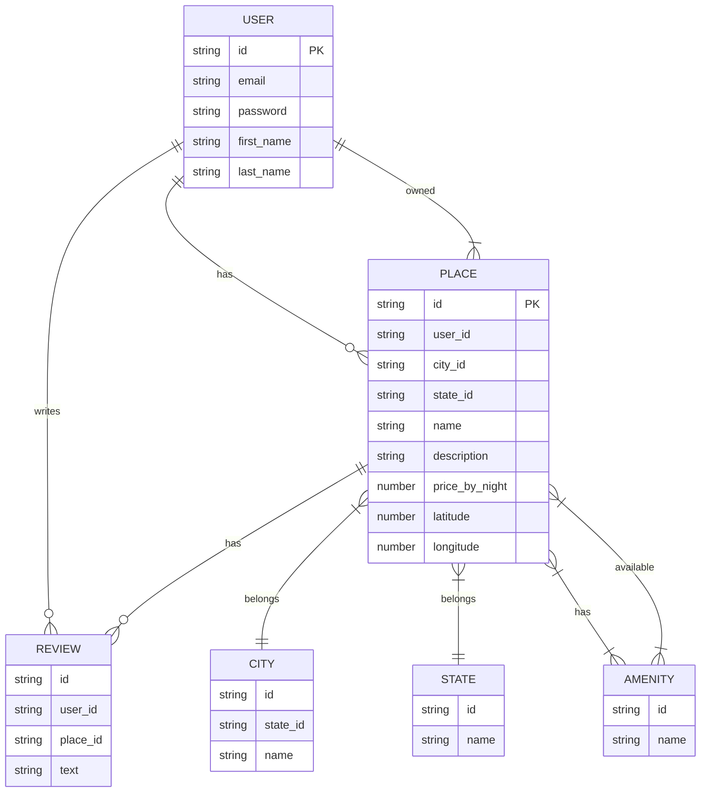

```mermaid
erDiagram
    USER ||--o{ PLACE : "has"
    USER ||--o{ REVIEW : "writes"
    PLACE ||--o{ REVIEW : "has"
    PLACE }|--|| CITY : "belongs"
    PLACE }|--|| STATE : "belongs"
    PLACE }|--|| USER : "owned"
    PLACE }|--|{ AMENITY : "has"
    AMENITY }|--|{ PLACE : "available"

    USER {
        string id PK
        string email
        string password
        string first_name
        string last_name
    }

    PLACE {
        string id PK
        string user_id
        string city_id
        string state_id
        string name
        string description
        number price_by_night
        number latitude
        number longitude
    }

    REVIEW {
        string id
        string user_id
        string place_id
        string text
    }

    CITY {
        string id
        string state_id
        string name
    }

    STATE {
        string id
        string name
    }

    AMENITY {
        string id
        string name
    }
    
```
