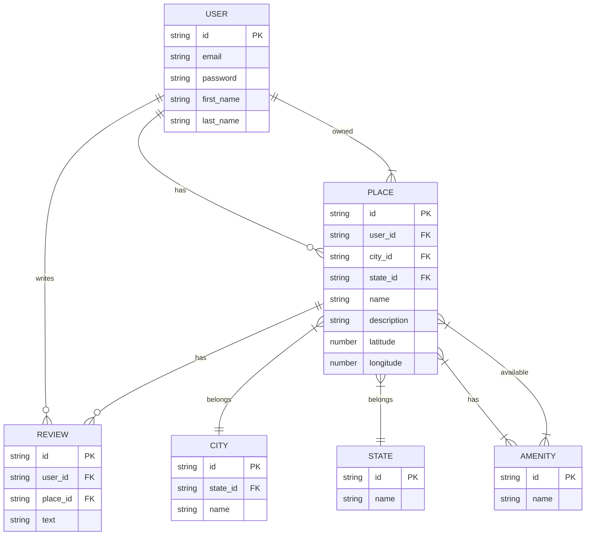

# C#26 :school:  - Part 3 - HBnB Team Project - Authentication and Database Integration -

## 📚 Overview
**HBnB** is a full-stack educational project inspired by Airbnb, developed at Holberton School.
This third part focuses on transforming the backend into a secure, scalable, and persistent system with user authentication, authorization, and a relational database.

## 🏗️ Features
- In Part 3, you will enhance the backend with:
- JWT-based user authentication for secure API access
- Role-based authorization (admin vs. standard user) using an is_admin field
- Transition from in-memory to persistent storage using a relational database
- SQL-based schema with scripts for table creation and data seeding
- ER diagrams (with mermaid.js) for visualizing relationships
- Shell and SQL scripts for easy database reset and CRUD testing

## 🎯 Objectives
1. Authentication & Authorization
    - Implement JWT authentication with Flask-JWT-Extended.
    - Secure all sensitive endpoints: only authenticated users can create, update, or delete their data.
    - Add role-based restrictions: only admin users can access certain resources.

2. Relational Database Integration
    - Replace in-memory storage with a real database (SQLite for development).
    - Provide migration-ready SQL scripts for deploying with MySQL or other RDBMS in production.
    - All CRUD operations now persist data to the database.
3. Data Modeling & Validation
    - Design the schema for users, places, reviews, amenities, and their relationships.
    - Enforce constraints for data consistency (e.g., unique email, foreign keys, unique reviews per user/place).
4. Visualization & Documentation
    - Draw an ER diagram of the schema using mermaid.js.
    - Provide documentation and scripts for setup, testing, and resetting the database.

## 🏛️ Database Design
 - users: User profiles, authentication info, admin flag
 - places: Listings created by users (with title, description, price, location)
 - amenities: Equipment/features for places
 - place_amenity: Many-to-many association table
 - reviews: Users’ ratings and feedback on places
 - All primary keys use UUIDs for uniqueness and portability.

 ## 🔒 API Security
 - JWT tokens are required for protected endpoints.
 - Only the owner of a resource (user, place, review) can update or delete it.
 - Admin users (is_admin) may have extra privileges (see RBAC implementation).
 - Public endpoints: anyone can view (GET) available places and details.

## 📊 Database Visualization
The entity-relationship diagram is written in Mermaid.js.
See [ERDIAGRAMS.MD](https://github.com/Genia888/holbertonschool-hbnb/blob/main/part3/ERDIAGRAMS.md) for details.


## 🚀 Getting Started
1. Reset and initialize the database
```bash
cd part3
./reset_db.sh
```
- This recreates the database (hbnb.db), creates all tables, and loads initial data.

2. Test CRUD operations
```bash
sqlite3 hbnb.db < test_crud.sql
```
- This will run create, read, update, and delete tests for each table.
```bash
sqlite3 hbnb.db
.tables
SELECT * FROM users;
.quit
```

## ✍️ Author
Holberton School — HBnB Project   
Team: 👥 - [Mr Phillips](https://github.com/ddoudou7) - [Sofian](https://github.com/smessaoui31) - [Evgeni](https://github.com/Genia888)


