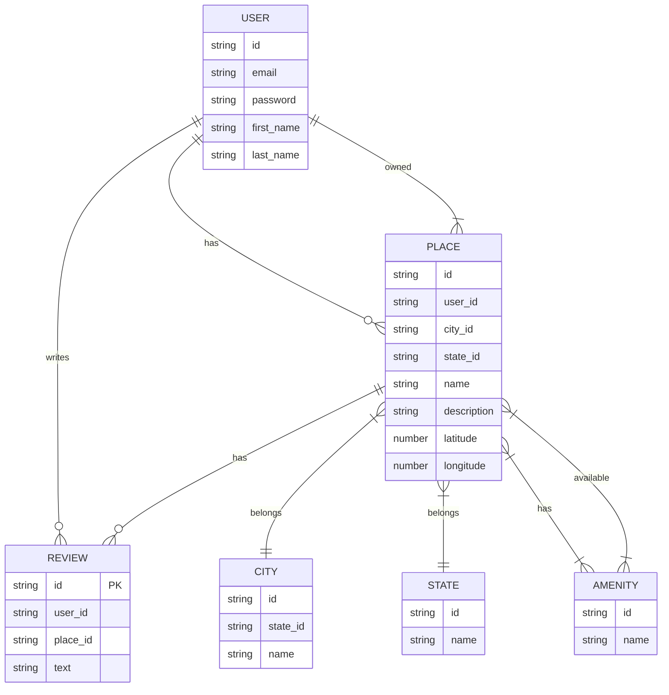

# C#26 :school:  - Part 3 - HBnB Team Project - Authentication and Database Integration -

## 📚 Overview
**HBnB** is a full-stack educational project inspired by Airbnb, developed at Holberton School.
This third part focuses on transforming the backend into a secure, scalable, and persistent system with user authentication, authorization, and a relational database.

## 🏗️ Features
- In Part 3, you will enhance the backend with:
- JWT-based user authentication for secure API access
- Role-based authorization (admin vs. standard user) using an is_admin field
- Transition from in-memory to persistent storage using a relational database
- SQL-based schema with scripts for table creation and data seeding
- ER diagrams (with mermaid.js) for visualizing relationships
- Shell and SQL scripts for easy database reset and CRUD testing

## 🎯 Objectives
1. Authentication & Authorization
    - Implement JWT authentication with Flask-JWT-Extended.
    - Secure all sensitive endpoints: only authenticated users can create, update, or delete their data.
    - Add role-based restrictions: only admin users can access certain resources.

2. Relational Database Integration
    - Replace in-memory storage with a real database (SQLite for development).
    - Provide migration-ready SQL scripts for deploying with MySQL or other RDBMS in production.
    - All CRUD operations now persist data to the database.
3. Data Modeling & Validation
    - Design the schema for users, places, reviews, amenities, and their relationships.
    - Enforce constraints for data consistency (e.g., unique email, foreign keys, unique reviews per user/place).
4. Visualization & Documentation
    - Draw an ER diagram of the schema using mermaid.js.
    - Provide documentation and scripts for setup, testing, and resetting the database.

## 🏛️ Database Design
 - users: User profiles, authentication info, admin flag
 - places: Listings created by users (with title, description, price, location)
 - amenities: Equipment/features for places
 - place_amenity: Many-to-many association table
 - reviews: Users’ ratings and feedback on places
 - All primary keys use UUIDs for uniqueness and portability.

 ## 🔒 API Security
 - JWT tokens are required for protected endpoints.
 - Only the owner of a resource (user, place, review) can update or delete it.
 - Admin users (is_admin) may have extra privileges (see RBAC implementation).
 - Public endpoints: anyone can view (GET) available places and details.

## 📊 Database Visualization
The entity-relationship diagram is written in Mermaid.js.
See [ERDIAGRAMS.MD](https://github.com/Genia888/holbertonschool-hbnb/blob/main/part3/ERDIAGRAMS.md) for details.


## 🚀 Getting Started
1. Reset and initialize the database
```bash
cd part3
./reset_db.sh
```
- This recreates the database (hbnb.db), creates all tables, and loads initial data.

2. Test CRUD operations
```bash
sqlite3 hbnb.db < test_crud.sql
```
- This will run create, read, update, and delete tests for each table.
```bash
sqlite3 hbnb.db
.tables
SELECT * FROM users;
.quit
```

---

## 📂 Features Overview

### ✅ Configurable Application Factory

The application uses the Factory pattern to support multiple configurations.  
By default, it loads `config.DevelopmentConfig`. You can override this with any configuration class.

Example:

```python
from app import create_app

app = create_app()
```

---

### ✅ Password Hashing with Flask-Bcrypt

User passwords are securely hashed and stored.  
The `User` model includes:

- `hash_password(password)`: Hashes and stores the password.
- `verify_password(password)`: Verifies a plaintext password against the hash.

Passwords are never returned in any API response.

---

### ✅ JWT Authentication

The API uses **JWT tokens** to authenticate users.  
Upon successful login, a JWT token is issued and must be included in the `Authorization` header for protected endpoints.

Example flow:

1. **Login:**  
   `POST /api/v1/auth/login` with email and password.  
   Returns a JWT access token.

2. **Access Protected Resources:**  
   Include the token in the header:  
   ```
   Authorization: Bearer <access_token>
   ```
   Example protected endpoint: `GET /api/v1/protected`

---

## 🛠️ Installation

**Install dependencies:**

```bash
pip install -r requirements.txt
```

Dependencies include:
- Flask
- Flask-Bcrypt
- Flask-JWT-Extended
- Flask-RESTX
- SQLAlchemy
- Flask-SQLAlchemy

---

## 🚀 Quick Start

### Create a User

```bash
curl -X POST "http://127.0.0.1:5000/api/v1/users/" \
-H "Content-Type: application/json" \
-d '{
  "first_name": "John",
  "last_name": "Doe",
  "email": "john.doe@example.com",
  "password": "supersecret"
}'
```

---

### Login to Get a Token

```bash
curl -X POST "http://127.0.0.1:5000/api/v1/auth/login" \
-H "Content-Type: application/json" \
-d '{
  "email": "john.doe@example.com",
  "password": "supersecret"
}'
```

---

### Call a Protected Endpoint

```bash
curl -X GET "http://127.0.0.1:5000/api/v1/protected" \
-H "Authorization: Bearer <your_token_here>"
```

---

## 🔒 Authenticated User Access

Authenticated users can create and manage their own places and reviews.  
They cannot modify resources owned by other users.

---

### 🧪 Example cURL Commands for Authenticated Users

#### Create a Place

```bash
curl -X POST "http://127.0.0.1:5000/api/v1/places/" \
-H "Authorization: Bearer <user_token>" \
-H "Content-Type: application/json" \
-d '{
  "title": "My New Place",
  "description": "A great place to stay.",
  "price": 150
}'
```

---

#### Update a Place

```bash
curl -X PUT "http://127.0.0.1:5000/api/v1/places/<place_id>" \
-H "Authorization: Bearer <user_token>" \
-H "Content-Type: application/json" \
-d '{
  "title": "Updated Title"
}'
```

---

#### Create a Review

```bash
curl -X POST "http://127.0.0.1:5000/api/v1/reviews/" \
-H "Authorization: Bearer <user_token>" \
-H "Content-Type: application/json" \
-d '{
  "place_id": "<place_id>",
  "text": "Awesome place!"
}'
```

---

#### Update a Review

```bash
curl -X PUT "http://127.0.0.1:5000/api/v1/reviews/<review_id>" \
-H "Authorization: Bearer <user_token>" \
-H "Content-Type: application/json" \
-d '{
  "text": "Updated my review."
}'
```

---

#### Delete a Review

```bash
curl -X DELETE "http://127.0.0.1:5000/api/v1/reviews/<review_id>" \
-H "Authorization: Bearer <user_token>"
```

---

#### Update Own User Info

```bash
curl -X PUT "http://127.0.0.1:5000/api/v1/users/<user_id>" \
-H "Authorization: Bearer <user_token>" \
-H "Content-Type: application/json" \
-d '{
  "first_name": "Updated Name",
  "last_name": "Updated Last Name"
}'
```

---

### 🟢 Public Endpoints

No authentication required.

#### List All Places

```bash
curl -X GET "http://127.0.0.1:5000/api/v1/places/"
```

---

#### Get Place Details

```bash
curl -X GET "http://127.0.0.1:5000/api/v1/places/<place_id>"
```

---

## 🛡️ Administrator Access

Admins can manage any user, place, or review.

---

### 🧪 Example cURL Commands for Admins

#### Create a User

```bash
curl -X POST "http://127.0.0.1:5000/api/v1/users/" \
-H "Authorization: Bearer <admin_token>" \
-H "Content-Type: application/json" \
-d '{
  "email": "newuser@example.com",
  "first_name": "Admin",
  "last_name": "User",
  "password": "securepassword"
}'
```

---

#### Modify a User

```bash
curl -X PUT "http://127.0.0.1:5000/api/v1/users/<user_id>" \
-H "Authorization: Bearer <admin_token>" \
-H "Content-Type: application/json" \
-d '{
  "email": "updatedemail@example.com",
  "first_name": "Updated Name",
  "password": "newpassword"
}'
```

---

#### Add an Amenity

```bash
curl -X POST "http://127.0.0.1:5000/api/v1/amenities/" \
-H "Authorization: Bearer <admin_token>" \
-H "Content-Type: application/json" \
-d '{
  "name": "Swimming Pool"
}'
```

---

#### Modify an Amenity

```bash
curl -X PUT "http://127.0.0.1:5000/api/v1/amenities/<amenity_id>" \
-H "Authorization: Bearer <admin_token>" \
-H "Content-Type: application/json" \
-d '{
  "name": "Updated Amenity"
}'
```

---

#### Update a Place as Admin

```bash
curl -X PUT "http://127.0.0.1:5000/api/v1/places/<place_id>" \
-H "Authorization: Bearer <admin_token>" \
-H "Content-Type: application/json" \
-d '{
  "title": "Admin Updated Place"
}'
```

---

#### Delete a Review as Admin

```bash
curl -X DELETE "http://127.0.0.1:5000/api/v1/reviews/<review_id>" \
-H "Authorization: Bearer <admin_token>"
```

---

## 🗄️ SQLAlchemy Repository Integration

This replaces the in-memory repository with SQLAlchemy persistence.

---

### 🛠️ Setup Overview

**Dependencies:**

```bash
pip install flask-sqlalchemy
```

---

**Configuration (`config.py`):**

```python
class DevelopmentConfig(Config):
    DEBUG = True
    SQLALCHEMY_DATABASE_URI = 'sqlite:///development.db'
    SQLALCHEMY_TRACK_MODIFICATIONS = False
```

---

**Initialization (`app/__init__.py`):**

```python
from flask_sqlalchemy import SQLAlchemy

db = SQLAlchemy()

def create_app(config_class=config.DevelopmentConfig):
    app = Flask(__name__)
    app.config.from_object(config_class)
    db.init_app(app)
    return app
```

---

**Repository Example:**

```python
class SQLAlchemyRepository:
    def __init__(self, model):
        self.model = model

    def add(self, obj):
        db.session.add(obj)
        db.session.commit()
```

---

## 🔑 Notes

- You must have an admin user for admin endpoints.
- Always include the `Authorization: Bearer <token>` header for protected routes.
- Run `db.create_all()` to initialize the database tables before testing.

---

## 🗄️ Mapping the User Entity to a SQLAlchemy Model

This section describes mapping the `User` entity to a SQLAlchemy model, implementing a dedicated repository, and refactoring the Facade to use it.

---

### 🎯 Objective

- Map `BaseModel` to a SQLAlchemy abstract model (with `id`, `created_at`, `updated_at`).
- Map the `User` model with proper columns and constraints.
- Create a `UserRepository` with custom queries.
- Refactor the `HBnBFacade` to use `UserRepository`.
- Initialize the database and test CRUD operations.

---

## 🛠️ Implementation Steps

---

### 1️⃣ Map `BaseModel`

**File:** `models/base_model.py`

```python
from app import db
import uuid
from datetime import datetime

class BaseModel(db.Model):
    __abstract__ = True

    id = db.Column(db.String(36), primary_key=True, default=lambda: str(uuid.uuid4()))
    created_at = db.Column(db.DateTime, default=datetime.utcnow)
    updated_at = db.Column(db.DateTime, default=datetime.utcnow, onupdate=datetime.utcnow)
```

---

### 2️⃣ Map `User` Model

**File:** `models/user.py`

```python
from app import db, bcrypt
from .base_model import BaseModel

class User(BaseModel):
    __tablename__ = 'users'

    first_name = db.Column(db.String(50), nullable=False)
    last_name = db.Column(db.String(50), nullable=False)
    email = db.Column(db.String(120), nullable=False, unique=True)
    password = db.Column(db.String(128), nullable=False)
    is_admin = db.Column(db.Boolean, default=False)

    def hash_password(self, password):
        """Hash the password before storing it."""
        self.password = bcrypt.generate_password_hash(password).decode('utf-8')

    def verify_password(self, password):
        """Verify the hashed password."""
        return bcrypt.check_password_hash(self.password, password)
```

✅ **Notes:**
- `unique=True` ensures no duplicate emails.
- Password hashing remains functional.

---

### 3️⃣ Create `UserRepository`

**File:** `services/repositories/user_repository.py`

```python
from app.models.user import User
from app.persistence.repository import SQLAlchemyRepository

class UserRepository(SQLAlchemyRepository):
    def __init__(self):
        super().__init__(User)

    def get_user_by_email(self, email):
        return self.model.query.filter_by(email=email).first()
```

✅ **Benefits:**
- Custom queries (`get_user_by_email`) encapsulated here.
- Easy to extend in the future.

---

### 4️⃣ Refactor the Facade

**File:** `services/facade.py`

```python
from app.services.repositories.user_repository import UserRepository
from app.models.user import User

class HBnBFacade:
    def __init__(self):
        self.user_repo = UserRepository()

    def create_user(self, user_data):
        user = User(**user_data)
        user.hash_password(user_data['password'])
        self.user_repo.add(user)
        return user

    def get_user(self, user_id):
        return self.user_repo.get(user_id)

    def get_user_by_email(self, email):
        return self.user_repo.get_user_by_email(email)
```

---

## 🛢️ Database Initialization

Before testing, **initialize the database**:

```bash
flask shell
```

Inside the shell:

```python
from app import db
db.create_all()
```

✅ This will create the `users` table.

---

## 🧪 Example cURL Commands

### Create a User

```bash
curl -X POST "http://127.0.0.1:5000/api/v1/users/" \
-H "Content-Type: application/json" \
-d '{
  "first_name": "John",
  "last_name": "Doe",
  "email": "john.doe@example.com",
  "password": "password123"
}'
```

---

### Retrieve a User by ID

```bash
curl -X GET "http://127.0.0.1:5000/api/v1/users/<user_id>"
```

---

### Login as User to Get a JWT Token

```bash
curl -X POST "http://127.0.0.1:5000/api/v1/auth/login" \
-H "Content-Type: application/json" \
-d '{
  "email": "john.doe@example.com",
  "password": "password123"
}'
```

---

## 🧭 Expected Outcome

✅ The `User` entity is stored persistently in the database.  
✅ The repository layer manages user-specific queries.  
✅ The Facade uses the `UserRepository`.  
✅ All CRUD operations are functional via API.

---

## 📚 Resources

- [SQLAlchemy Documentation](https://docs.sqlalchemy.org/)
- [Flask-SQLAlchemy Documentation](https://flask-sqlalchemy.palletsprojects.com/)
- [Flask-Bcrypt](https://flask-bcrypt.readthedocs.io/)
- [cURL Guide](https://everything.curl.dev/http/post)

---

## 🔗 Mapping Relationships Between Entities with SQLAlchemy

This section describes how to map relationships between your entities (`User`, `Place`, `Review`, `Amenity`) to enable efficient queries and enforce data integrity.

---

### 🎯 Objective

- Define **one-to-many** and **many-to-many** relationships:
  - User ➡️ Places
  - Place ➡️ Reviews
  - User ➡️ Reviews
  - Place ⬌ Amenities
- Use `relationship()` and `ForeignKey` constraints.
- Enable bidirectional access (`backref`) between linked entities.

---

## 🛠️ Relationships to Implement

✅ **User ↔️ Place**
- A User owns many Places.
- A Place belongs to a User.

✅ **Place ↔️ Review**
- A Place has many Reviews.
- A Review belongs to a Place.

✅ **User ↔️ Review**
- A User writes many Reviews.
- A Review belongs to a User.

✅ **Place ⬌ Amenity**
- Many Places can have many Amenities.
- Many Amenities can belong to many Places.

---

## 🧩 Model Implementations

Below is example code you can adapt in your project.

---

### 1️⃣ `User` Model

**File:** `models/user.py`

```python
from app import db, bcrypt
from .base_model import BaseModel

class User(BaseModel):
    __tablename__ = 'users'

    first_name = db.Column(db.String(50), nullable=False)
    last_name = db.Column(db.String(50), nullable=False)
    email = db.Column(db.String(120), nullable=False, unique=True)
    password = db.Column(db.String(128), nullable=False)
    is_admin = db.Column(db.Boolean, default=False)

    # One-to-Many: User has many Places
    places = db.relationship('Place', backref='owner', lazy=True)

    # One-to-Many: User has many Reviews
    reviews = db.relationship('Review', backref='author', lazy=True)

    def hash_password(self, password):
        self.password = bcrypt.generate_password_hash(password).decode('utf-8')

    def verify_password(self, password):
        return bcrypt.check_password_hash(self.password, password)
```

---

### 2️⃣ `Place` Model

**File:** `models/place.py`

```python
from app import db
from .base_model import BaseModel

# Association table for many-to-many Place-Amenity
place_amenity = db.Table('place_amenity',
    db.Column('place_id', db.String(36), db.ForeignKey('places.id'), primary_key=True),
    db.Column('amenity_id', db.String(36), db.ForeignKey('amenities.id'), primary_key=True)
)

class Place(BaseModel):
    __tablename__ = 'places'

    title = db.Column(db.String(100), nullable=False)
    description = db.Column(db.Text, nullable=True)
    price = db.Column(db.Float, nullable=False)

    # FK to User
    user_id = db.Column(db.String(36), db.ForeignKey('users.id'), nullable=False)

    # One-to-Many: Place has many Reviews
    reviews = db.relationship('Review', backref='place', lazy=True)

    # Many-to-Many: Place has many Amenities
    amenities = db.relationship('Amenity', secondary=place_amenity, lazy='subquery',
                                backref=db.backref('places', lazy=True))
```

---

### 3️⃣ `Review` Model

**File:** `models/review.py`

```python
from app import db
from .base_model import BaseModel

class Review(BaseModel):
    __tablename__ = 'reviews'

    text = db.Column(db.Text, nullable=False)

    # FK to User (author)
    user_id = db.Column(db.String(36), db.ForeignKey('users.id'), nullable=False)

    # FK to Place
    place_id = db.Column(db.String(36), db.ForeignKey('places.id'), nullable=False)
```

---

### 4️⃣ `Amenity` Model

**File:** `models/amenity.py`

```python
from app import db
from .base_model import BaseModel

class Amenity(BaseModel):
    __tablename__ = 'amenities'

    name = db.Column(db.String(50), nullable=False, unique=True)
```

---

## 🟢 Example: What This Enables

✅ For a given `User`, you can do:
```python
user = User.query.first()
user.places  # All places created by this user
user.reviews  # All reviews written by this user
```

✅ For a `Place`:
```python
place = Place.query.first()
place.reviews  # All reviews of the place
place.amenities  # All amenities linked to the place
place.owner  # The User who owns the place
```

✅ For a `Review`:
```python
review = Review.query.first()
review.author  # The User who wrote it
review.place   # The Place it refers to
```

✅ For an `Amenity`:
```python
amenity = Amenity.query.first()
amenity.places  # All Places that have this amenity
```

---

## 🛢️ Initialize the Database

After defining the models, create tables:

```bash
flask shell
```

Inside the shell:

```python
from app import db
db.create_all()
```

---

## 🧪 Example cURL Commands to Test Relationships

---

### Create a User

```bash
curl -X POST "http://127.0.0.1:5000/api/v1/users/" \
-H "Content-Type: application/json" \
-d '{
  "first_name": "Alice",
  "last_name": "Smith",
  "email": "alice@example.com",
  "password": "testpassword"
}'
```

---

### Create an Amenity

```bash
curl -X POST "http://127.0.0.1:5000/api/v1/amenities/" \
-H "Authorization: Bearer <admin_token>" \
-H "Content-Type: application/json" \
-d '{
  "name": "WiFi"
}'
```

---

### Create a Place Linked to a User

```bash
curl -X POST "http://127.0.0.1:5000/api/v1/places/" \
-H "Authorization: Bearer <user_token>" \
-H "Content-Type: application/json" \
-d '{
  "title": "Beautiful Apartment",
  "description": "Spacious and bright",
  "price": 120
}'
```

---

### Create a Review Linked to a Place and User

```bash
curl -X POST "http://127.0.0.1:5000/api/v1/reviews/" \
-H "Authorization: Bearer <user_token>" \
-H "Content-Type: application/json" \
-d '{
  "place_id": "<place_id>",
  "text": "Fantastic stay!"
}'
```

---

### Add an Amenity to a Place

Since many-to-many relations are usually handled by updating the Place’s amenities list in code, you can also implement a dedicated endpoint to attach amenities to a place (not shown here).

---

## 🧭 Expected Outcome

✅ All relationships are mapped correctly:
- User ➡️ Places (1:N)
- Place ➡️ Reviews (1:N)
- User ➡️ Reviews (1:N)
- Place ⬌ Amenities (N:M)

✅ You can query bidirectional links easily.

✅ Data integrity is enforced via foreign keys.

---

## 📚 Resources

- [SQLAlchemy Relationships](https://docs.sqlalchemy.org/en/20/orm/basic_relationships.html)
- [Flask-SQLAlchemy](https://flask-sqlalchemy.palletsprojects.com/)
- [cURL](https://everything.curl.dev/http/post)

---

## 🗄️ SQL Scripts for Table Generation and Initial Data

This section describes how to create the database schema for the HBnB project using **raw SQL** and insert initial data.

---

### 🎯 Objective

- Generate SQL scripts to create all tables and relationships:
  - `User`
  - `Place`
  - `Review`
  - `Amenity`
  - `Place_Amenity`
- Insert initial data (admin user + amenities).
- Test CRUD operations.

---

## 🛠️ SQL Table Creation Scripts

---

### 1️⃣ User Table

```sql
CREATE TABLE IF NOT EXISTS users (
    id CHAR(36) PRIMARY KEY,
    first_name VARCHAR(255) NOT NULL,
    last_name VARCHAR(255) NOT NULL,
    email VARCHAR(255) UNIQUE NOT NULL,
    password VARCHAR(255) NOT NULL,
    is_admin BOOLEAN DEFAULT FALSE
);
```

---

### 2️⃣ Place Table

```sql
CREATE TABLE IF NOT EXISTS places (
    id CHAR(36) PRIMARY KEY,
    title VARCHAR(255) NOT NULL,
    description TEXT,
    price DECIMAL(10, 2) NOT NULL,
    latitude FLOAT,
    longitude FLOAT,
    owner_id CHAR(36) NOT NULL,
    FOREIGN KEY (owner_id) REFERENCES users(id)
);
```

---

### 3️⃣ Review Table

```sql
CREATE TABLE IF NOT EXISTS reviews (
    id CHAR(36) PRIMARY KEY,
    text TEXT NOT NULL,
    rating INT CHECK (rating BETWEEN 1 AND 5),
    user_id CHAR(36) NOT NULL,
    place_id CHAR(36) NOT NULL,
    FOREIGN KEY (user_id) REFERENCES users(id),
    FOREIGN KEY (place_id) REFERENCES places(id),
    UNIQUE (user_id, place_id)
);
```

---

### 4️⃣ Amenity Table

```sql
CREATE TABLE IF NOT EXISTS amenities (
    id CHAR(36) PRIMARY KEY,
    name VARCHAR(255) UNIQUE NOT NULL
);
```

---

### 5️⃣ Place_Amenity Table (Many-to-Many)

```sql
CREATE TABLE IF NOT EXISTS place_amenity (
    place_id CHAR(36) NOT NULL,
    amenity_id CHAR(36) NOT NULL,
    PRIMARY KEY (place_id, amenity_id),
    FOREIGN KEY (place_id) REFERENCES places(id),
    FOREIGN KEY (amenity_id) REFERENCES amenities(id)
);
```

---

## 🔑 Notes

- UUIDs are `CHAR(36)` in all tables.
- Foreign keys enforce referential integrity.
- Reviews are unique per `(user_id, place_id)`.

---

## 🧩 Initial Data Insertion Scripts

---

### 1️⃣ Insert Administrator User

**Note:** You must hash the password `admin1234` with bcrypt.  
Example bcrypt hash (DO NOT use in production):

```
$2b$12$eIXqaejYk6bIsJH6jwSzzuzlO7jH9MuG1YZcQFlDfZaY45s1JuAae
```

**SQL Insert:**

```sql
INSERT INTO users (
    id,
    first_name,
    last_name,
    email,
    password,
    is_admin
) VALUES (
    '36c9050e-ddd3-4c3b-9731-9f487208bbc1',
    'Admin',
    'HBnB',
    'admin@hbnb.io',
    '$2b$12$eIXqaejYk6bIsJH6jwSzzuzlO7jH9MuG1YZcQFlDfZaY45s1JuAae',
    TRUE
);
```

---

### 2️⃣ Insert Initial Amenities

Generate UUIDs for each amenity. Example UUIDs below:

- WiFi: `11111111-1111-1111-1111-111111111111`
- Swimming Pool: `22222222-2222-2222-2222-222222222222`
- Air Conditioning: `33333333-3333-3333-3333-333333333333`

**SQL Inserts:**

```sql
INSERT INTO amenities (id, name) VALUES
('11111111-1111-1111-1111-111111111111', 'WiFi'),
('22222222-2222-2222-2222-222222222222', 'Swimming Pool'),
('33333333-3333-3333-3333-333333333333', 'Air Conditioning');
```

---

## 🧪 Testing CRUD Operations

After running the scripts, verify:

✅ **Tables exist**

```sql
SELECT name FROM sqlite_master WHERE type='table';
```

✅ **Admin user is inserted**

```sql
SELECT * FROM users WHERE email = 'admin@hbnb.io';
```

✅ **Amenities are inserted**

```sql
SELECT * FROM amenities;
```

✅ **Insert a place**

```sql
INSERT INTO places (
    id, title, description, price, latitude, longitude, owner_id
) VALUES (
    '44444444-4444-4444-4444-444444444444',
    'Lovely Loft',
    'Beautiful loft in the city center.',
    120.00,
    48.8566,
    2.3522,
    '36c9050e-ddd3-4c3b-9731-9f487208bbc1'
);
```

✅ **Insert a review**

```sql
INSERT INTO reviews (
    id, text, rating, user_id, place_id
) VALUES (
    '55555555-5555-5555-5555-555555555555',
    'Amazing stay!',
    5,
    '36c9050e-ddd3-4c3b-9731-9f487208bbc1',
    '44444444-4444-4444-4444-444444444444'
);
```

✅ **Link a place to an amenity**

```sql
INSERT INTO place_amenity (place_id, amenity_id) VALUES (
    '44444444-4444-4444-4444-444444444444',
    '11111111-1111-1111-1111-111111111111'
);
```

---

## 🧭 Expected Outcome

✅ The schema is created with all tables and constraints.  
✅ An admin user and amenities are inserted successfully.  
✅ CRUD operations work as expected.  
✅ Relationships between entities are functional.

---

## 📚 Resources

- [W3Schools SQL Tutorial](https://www.w3schools.com/sql/)
- [PostgreSQL UUID Generation](https://www.postgresql.org/docs/current/functions-uuid.html)
- [Bcrypt Password Hashing](https://bcrypt-generator.com/)

---

## ✍️ Author
Holberton School — HBnB Project   
Team: 👥 - [Mr Phillips](https://github.com/ddoudou7) - [Sofian](https://github.com/smessaoui31) - [Evgeni](https://github.com/Genia888)